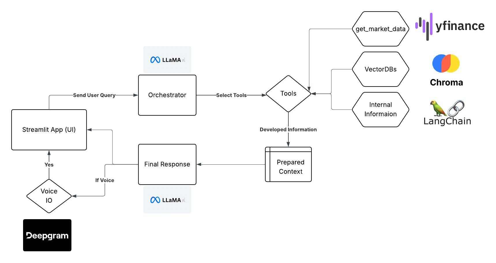

## Market Brief Agent

### Workflow Diagram
---


#### Overview
* An acyclic workflow where the user interacts through a Streamlit App.
* User's query is first parsed by the Orchestrator API endpoint that returns the result for what tools to use along with the result of those tools' execution.
* The original user query and the generated supporting context are then passed to the final response synthesizer.
* Final response is streamed back to the Streamlit app again via API communication.
* User can further instruct to listen to the generated response using Deepgram's voice models.

### Tools 

**All tools are accessible through an API interface**
* `/data/get_historical_data` : This tool brings historical changes in a particular given stock. Must provide a YFinance ticker as a parameter.
* `/data/get_earning_metrics` : This tool generates the stock earnings summary over the past 3–4 years using YFinance earning metrics.
* `/data/get_portfolio_data` : This tool brings a current portfolio snapshot/updates. *Currently only supports IND portfolio*.
* `/data/get_portfolio_data` : This is a ***RAG*** based tool. It uses a company's prior documents as a knowledge base and uses semantic similarity to provide context on company-related user queries.
* `/data/get_portfolio_data` : Tool to make orchestration decisions—i.e., which tool to call with what parameters.
* `/data/get_portfolio_data` : Tool to generate the final user-friendly response with **guardrails** to avoid giving aggressive financial advice.

### Deployment

Fully functional **Docker**-based deployment for maintainability and scalability.

```DOCKER FILE CODE```

#### FYIs
* Voice I/O is slow because of Streamlit voice processing and Deepgram API latency.
