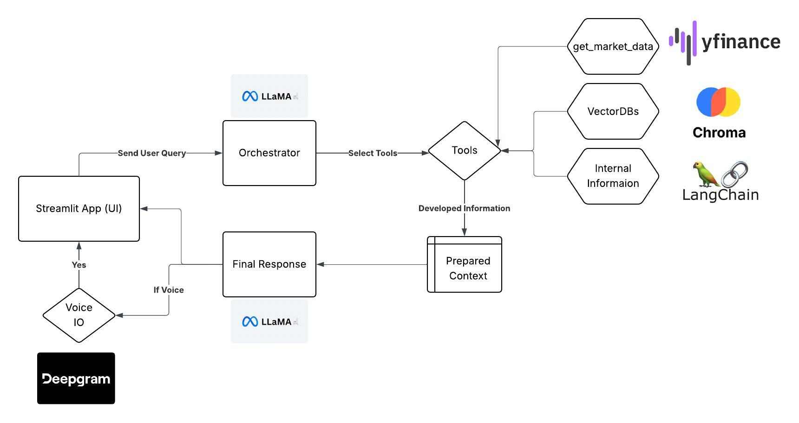

# Detailed Documentation 



## Table of Contents

1. [Models Used](#models-used)  
   1.1 [Large Language Models (LLMs)](#large-language-models-llms)  
   1.2 [Embedding Model](#embedding-model)

2. [Vector Database](#vector-database)  
   2.1 [Document Reading & Text Preprocessing (LangChain)](#document-reading--text-preprocessing-langchain)  
   2.2 [VectorDB](#vectordb)

3. [Financial Data API](#financial-data-api)


## Models Used

### Large Language Models (LLMs)

LLMs are used in two agents: one for orchestration and another for generating the final response. The model used is `Meta-LLaMA-3.3-70B`.

Why `Meta-LLaMA-3.3-70B`?
* It is an auto-regressive language model utilizing an optimized transformer architecture.
* It is fine-tuned with Supervised Fine-Tuning (SFT) and Reinforcement Learning with Human Feedback (RLHF) to align with human preferences for helpfulness and safety.
* It is pretrained on approximately 15 trillion tokens from publicly available sources. The fine-tuning data includes public instruction datasets and over 25 million synthetically generated examples.
* The pretraining data cutoff is **December 2023**, making it relatively up to date. Any more recent information can be obtained using agentic tools.

Agents using the above LLM:

1) **Orchestrator Agent** – Responsible for selecting and invoking tools based on the user's query. It is instruction-tuned to generate responses in a predefined JSON schema outlined in the System Prompt.

```json
Query: What is the change in Apple stock in the past 1 month?

Response:
{
  "tool": "get_change",
  "parameters": {
    "symbol": "AAPL",
    "period": 31
  }
}

Query: Hi, how are you?

Response:
{
  "tool": null,
  "parameters": {
    "response": "Hey! I am fine. How can I help you today?"
  }
}

Query: How does the general market look?

Response:
{
  "tool": "get_update",
  "parameters": {
    "response": "^NSEI"
  }
}
```

Complex engineered prompts are achieved through an iterative trial-and-error process to achieve the desired responses and results.

2) **Final Response Agent** – Responsible for generating the final, user-centric response aimed at resolving the user's query using both the context/information received from the orchestrator’s tool calls and its own analysis. It is fine-tuned to be respectful and helpful to the user. It also considers the previous chat history as context to deliver more informed and coherent responses. This agent is used as a streaming response generator to maximize efficiency.

## Embedding Model

An embedding model is used in the RAG (Retrieval-Augmented Generation) pipeline to leverage the company's internal knowledge base. The chosen model is `M2-BERT-80M-2k-retrieval`, a BERT-based (encoder-only) embedding model. Its purpose is to project natural language chunks into a fixed-dimensional embedding space while preserving semantic properties for efficient retrieval.

Why `M2-BERT-80M-2k-retrieval`?

* Vanilla BERT has quadratic complexity due to the attention mechanism, whereas M2 (Monarch Mixers) scales to 3/2 with respect to sequence length.
* It supports a context window of 2048 tokens, which is 4x larger than that of vanilla BERT.
* It is specifically trained for retrieval tasks, allowing it to capture semantic representations effectively.

## Vector Database

### Document Reading & Text Preprocessing (LangChain)

**LangChain** is used for reading and preprocessing documents.

* Used LangChain’s PyPDF binding to read and extract structured text from PDFs.
* Used LangChain's preprocessing toolkit to process raw text into usable Python data structures.
* Employed LangChain text splitters, such as `RecursiveCharacterTextSplitter`, to split text based on markers while maintaining the document structure in the resulting chunks.

### VectorDB

**ChromaDB** is used as the Vector Database solution due to the following advantages:

* Its native embedding store is purpose-built for storing and querying vector embeddings, making it ideal for AI/LLM applications.
* It is Python-native and easy to use, allowing seamless integration with Python-based workflows with minimal setup.
* It supports both in-memory and persistent storage, offering flexibility for local development as well as production environments.
* It uses the HNSW (Hierarchical Navigable Small World) graph algorithm for Approximate Nearest Neighbor (ANN) search, enabling fast and scalable KNN retrieval in high-dimensional spaces.

## Financial Data API

**YFinance** is used to fetch the latest stock-specific data for providing real-time context to the application. Reasons for choosing `yfinance`:

* Provides easy access to Yahoo Finance data, allowing historical market data, financials, and real-time quotes to be downloaded effortlessly.
* It is Python-native and user-friendly, integrating smoothly into data science and financial analysis workflows.
* Supports downloading historical OHLCV (Open, High, Low, Close, Volume) data for stocks, ETFs, crypto, and more with just a few lines of code.
* Enables access to ticker fundamentals such as balance sheets, income statements, cash flow statements, and key financial ratios.
